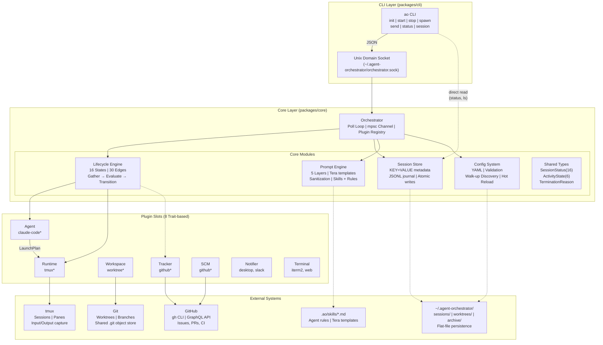
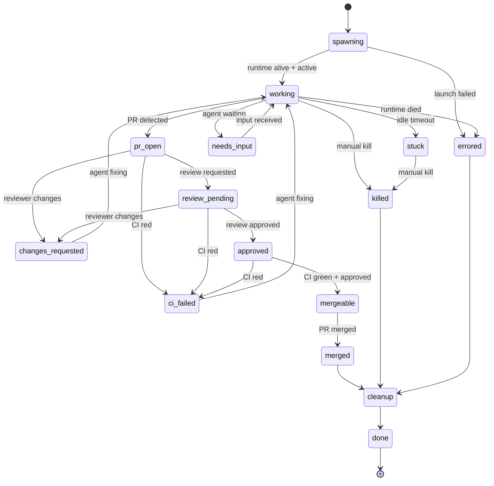
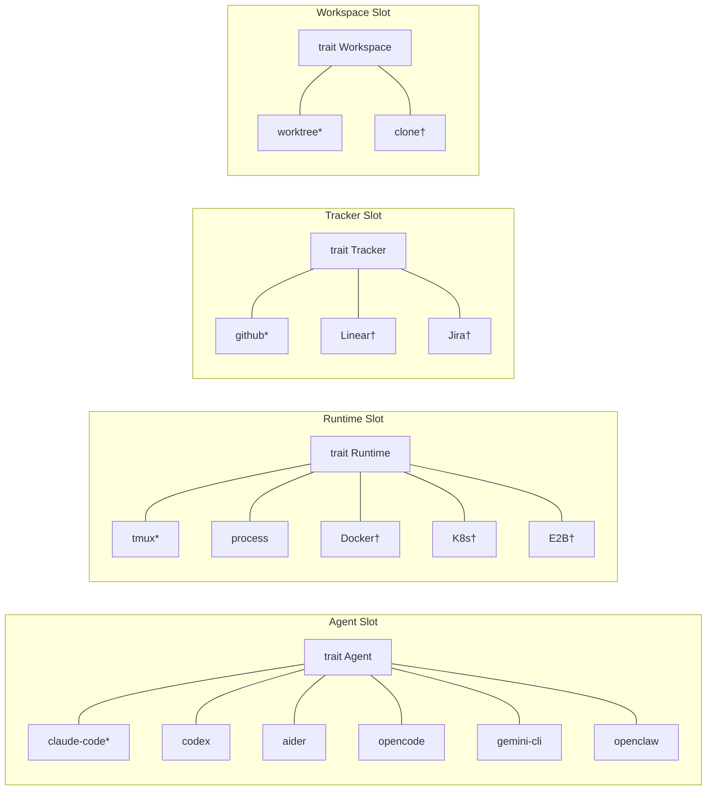
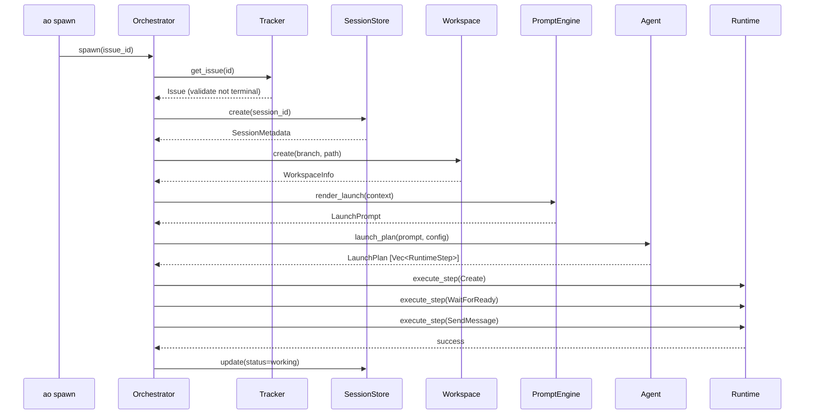
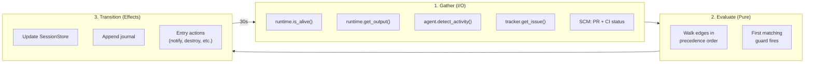

# Conductor Architecture

```mermaid
graph TB
    subgraph CLI["CLI Layer (packages/cli)"]
        ao["ao CLI<br/>init | start | stop | spawn<br/>send | status | session"]
        ipc["Unix Domain Socket<br/>(~/.agent-orchestrator/orchestrator.sock)"]
        ao -->|"JSON"| ipc
    end

    subgraph Core["Core Layer (packages/core)"]
        orch["Orchestrator<br/>Poll Loop | mpsc Channel | Plugin Registry"]

        subgraph Modules["Core Modules"]
            lifecycle["Lifecycle Engine<br/>16 States | 30 Edges<br/>Gather → Evaluate → Transition"]
            session["Session Store<br/>KEY=VALUE metadata<br/>JSONL journal | Atomic writes"]
            prompt["Prompt Engine<br/>5 Layers | Tera templates<br/>Sanitization | Skills + Rules"]
            config["Config System<br/>YAML | Validation<br/>Walk-up Discovery | Hot Reload"]
            types["Shared Types<br/>SessionStatus(16)<br/>ActivityState(6)<br/>TerminationReason"]
        end

        orch --> lifecycle
        orch --> session
        orch --> prompt
        orch --> config
    end

    subgraph Plugins["Plugin Slots (8 Trait-based)"]
        agent["Agent<br/>claude-code*"]
        runtime["Runtime<br/>tmux*"]
        workspace["Workspace<br/>worktree*"]
        tracker["Tracker<br/>github*"]
        scm["SCM<br/>github*"]
        notifier["Notifier<br/>desktop, slack"]
        terminal["Terminal<br/>iterm2, web"]
    end

    subgraph External["External Systems"]
        github["GitHub<br/>gh CLI | GraphQL API<br/>Issues, PRs, CI"]
        tmux["tmux<br/>Sessions | Panes<br/>Input/Output capture"]
        fs["~/.agent-orchestrator/<br/>sessions/ | worktrees/ | archive/<br/>Flat-file persistence"]
        git["Git<br/>Worktrees | Branches<br/>Shared .git object store"]
        skills[".ao/skills/*.md<br/>Agent rules | Tera templates"]
    end

    ipc --> orch
    ao -.->|"direct read<br/>(status, ls)"| session

    lifecycle --> agent
    lifecycle --> runtime
    lifecycle -.-> tracker

    agent -->|"LaunchPlan"| runtime
    tracker --> github
    runtime --> tmux
    workspace --> git
    session -.-> fs
    prompt -.-> skills
    scm --> github
    config -.-> fs
```

## Session Lifecycle State Machine

```mermaid
stateDiagram-v2
    [*] --> spawning

    spawning --> working: runtime alive + active
    spawning --> errored: launch failed

    working --> pr_open: PR detected
    working --> needs_input: agent waiting
    working --> stuck: idle timeout
    working --> errored: runtime died

    pr_open --> review_pending: review requested
    pr_open --> ci_failed: CI red
    pr_open --> changes_requested: reviewer changes

    review_pending --> approved: review approved
    review_pending --> changes_requested: reviewer changes
    review_pending --> ci_failed: CI red

    approved --> mergeable: CI green + approved
    approved --> ci_failed: CI red

    mergeable --> merged: PR merged

    ci_failed --> working: agent fixing
    changes_requested --> working: agent fixing
    needs_input --> working: input received

    working --> killed: manual kill
    stuck --> killed: manual kill

    merged --> cleanup
    killed --> cleanup
    errored --> cleanup

    cleanup --> done
    done --> [*]
```

## Plugin Slot Architecture

```mermaid
graph LR
    subgraph AgentSlot["Agent Slot"]
        direction TB
        at["trait Agent"]
        cc["claude-code*"]
        codex["codex"]
        aider["aider"]
        opencode["opencode"]
        gemini["gemini-cli"]
        openclaw["openclaw"]
        at --- cc
        at --- codex
        at --- aider
        at --- opencode
        at --- gemini
        at --- openclaw
    end

    subgraph RuntimeSlot["Runtime Slot"]
        direction TB
        rt["trait Runtime"]
        tmux2["tmux*"]
        process["process"]
        docker["Docker†"]
        k8s["K8s†"]
        e2b["E2B†"]
        rt --- tmux2
        rt --- process
        rt --- docker
        rt --- k8s
        rt --- e2b
    end

    subgraph TrackerSlot["Tracker Slot"]
        direction TB
        tt["trait Tracker"]
        gh["github*"]
        linear["Linear†"]
        jira["Jira†"]
        tt --- gh
        tt --- linear
        tt --- jira
    end

    subgraph WorkspaceSlot["Workspace Slot"]
        direction TB
        wt["trait Workspace"]
        worktree["worktree*"]
        clone["clone†"]
        wt --- worktree
        wt --- clone
    end
```

`* = MVP implementation` `† = Post-MVP planned`

## Spawn Sequence

```mermaid
sequenceDiagram
    participant CLI as ao spawn
    participant O as Orchestrator
    participant T as Tracker
    participant SS as SessionStore
    participant W as Workspace
    participant PE as PromptEngine
    participant A as Agent
    participant R as Runtime

    CLI->>O: spawn(issue_id)
    O->>T: get_issue(id)
    T-->>O: Issue (validate not terminal)
    O->>SS: create(session_id)
    SS-->>O: SessionMetadata
    O->>W: create(branch, path)
    W-->>O: WorkspaceInfo
    O->>PE: render_launch(context)
    PE-->>O: LaunchPrompt
    O->>A: launch_plan(prompt, config)
    A-->>O: LaunchPlan [Vec<RuntimeStep>]
    O->>R: execute_step(Create)
    O->>R: execute_step(WaitForReady)
    O->>R: execute_step(SendMessage)
    R-->>O: success
    O->>SS: update(status=working)
```

## Poll Cycle

```mermaid
graph LR
    subgraph Gather["1. Gather (I/O)"]
        g1["runtime.is_alive()"]
        g2["runtime.get_output()"]
        g3["agent.detect_activity()"]
        g4["tracker.get_issue()"]
        g5["SCM: PR + CI status"]
    end

    subgraph Evaluate["2. Evaluate (Pure)"]
        e1["Walk edges in<br/>precedence order"]
        e2["First matching<br/>guard fires"]
    end

    subgraph Transition["3. Transition (Effects)"]
        t1["Update SessionStore"]
        t2["Append journal"]
        t3["Entry actions<br/>(notify, destroy, etc.)"]
    end

    Gather --> Evaluate --> Transition
    Transition -->|"30s"| Gather
```
